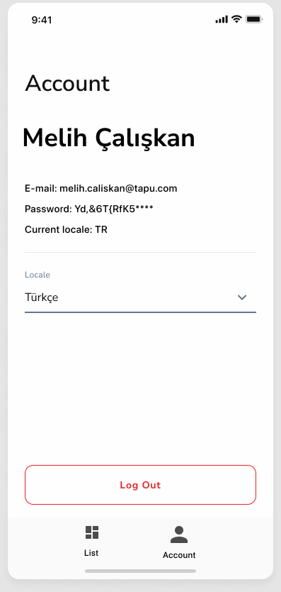

## Tapu.com Case
Kayıt olma, ürün listeleme, sepet işlemlerinin bulunduğu React projesi

### İstenilenler
<ol>
  <li>Ekranda gördüğünüz tasarımları uzmanlık alanınıza göre react, vue veya pure javascript kullanarak kodlamanız beklenmektedir.</li>
  <li>Axios veya fetch api kullanılarak sunucu alışverişlerinin yapılması</li>
  <li>Ürün listeleme sayfası yaparak sepete ekle/çıkar yapılması ve ürünlerin ve ürün toplamlarının gösterilmesi</li>
  <li>Listeleme sayfası için nodejs mock server oluşturarak data alışverişlerinin sağlanması artı puandır. Dilerseniz hazır placeholder sitelerinden de data çekebilirsiniz</li>
  <li>Flex, Grid veya Styled components yapısının kullanılması</li>
  <li>Herhangi bir sayfanın class yapısında yapılması, diğer sayfaların class veya function farketmeksizin kodlanması beklenmektedir. Vanilla js kullanacak adayların en az bir methodunun class yapısında olması</li>
  <li>Sayfada kullanılacak görsellerin, performans konusu göz önünde alınarak sayfada ön yüklenmesinin sağlanması (preload, lazy, observer)</li>
  <li>Sayfaların mobile-first prensibiyle kodlanması telefon/tablet responsive görünümlerinin stabil çalışması beklenmektedir.</li>
</ol>

### Kullanılan Teknolojiler

- React
- React Router Dom
- Context API
- Axios
- Formik
- Yup
- i18n
- Styled Components
- React Toastify

### Ekran Görüntüleri

<table>
  <tr>
    <td valign="top">
        
    </td>
     <td valign="top">
       
    </td>
     <td valign="top">
       
    </td>
  </tr>
</table>

